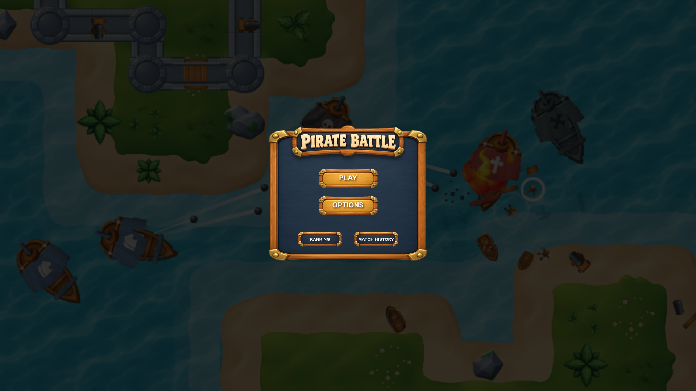
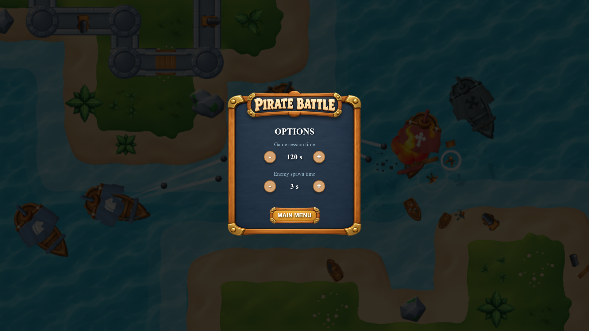
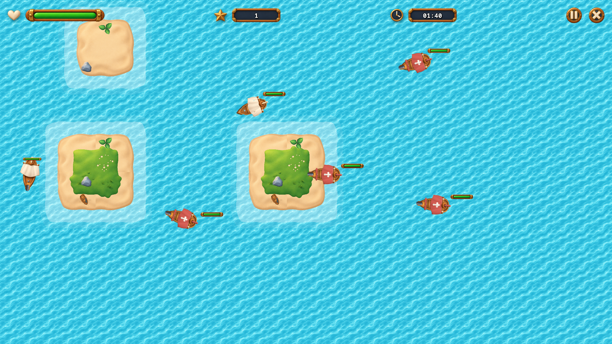
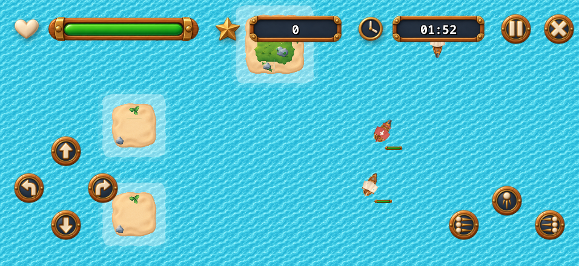
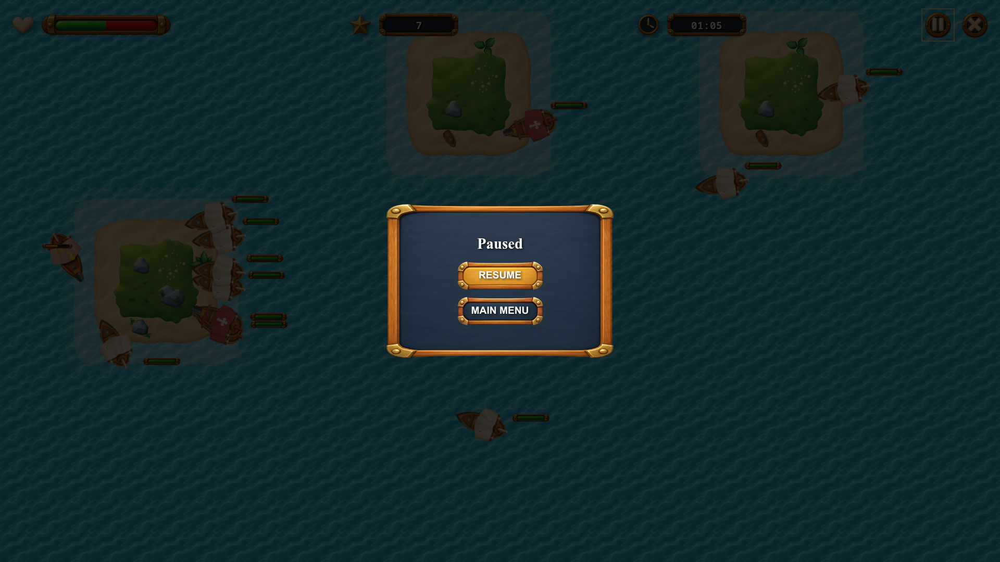
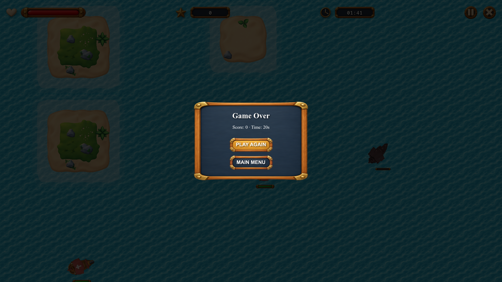
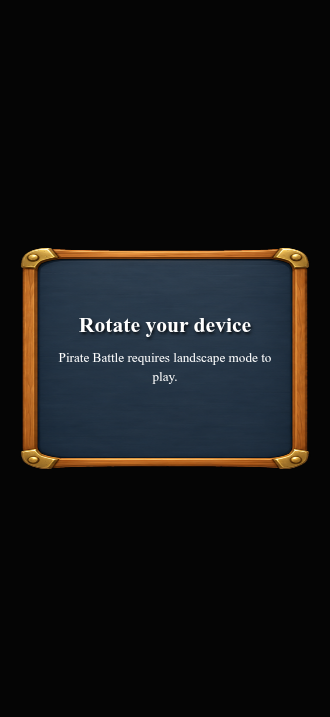
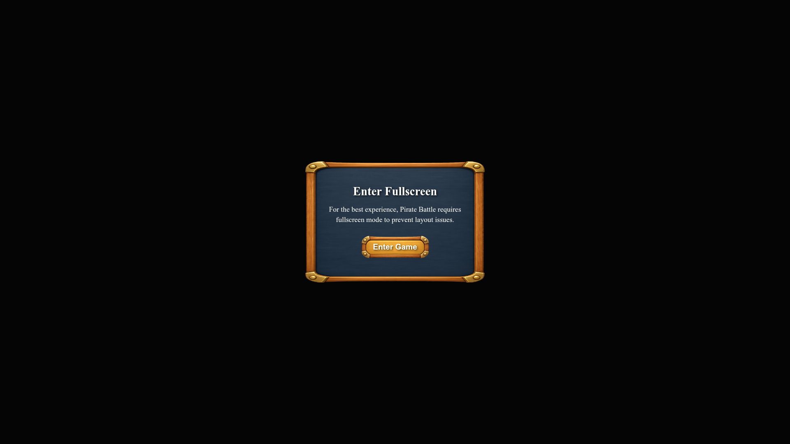

<div align="center">

# Pirate Battle

<p align="center">
  
</p>

### A 2D top-down naval combat game

Built with **React**, **TypeScript**, and **PixiJS** as part of a game developer challenge.

[Challenge Requirements](./README-CHALLENGE.md) · [Architecture Notes](./ARCHITECTURE.md)

</div>

---

## Project status

This repository contains a playable core, but **does not yet satisfy every challenge requirement**. The table below is an implementation snapshot based on the current source code, not a formal score from the recruiting company.

The core gameplay, PixiJS architecture, interface, and settings are partially implemented. Ranking/history, API mocking, and automated tests are not implemented, while performance evidence and deployment are pending; therefore, the project is not yet ready for final challenge submission.

| Challenge area | Status | Current implementation |
| --- | --- | --- |
| Gameplay | **Partial** | Player movement, front and broadside fire, Chaser and Shooter enemies, health, score, projectiles, islands, collision handling, configurable match length, and a HUD are implemented. |
| PixiJS architecture | **Partial** | The game loop, session lifecycle, terrain generation, spawning, and physics have separate responsibilities. Asset loading feedback and cleanup are present; performance evidence and full lifecycle verification are not. |
| Menus and interface | **Partial** | Main menu, Options, touch controls, pause, and a result modal are present. Ranking and Match History are placeholders; control instructions, accessibility checks, and complete result details remain outstanding. |
| Gameplay settings | **Partial** | Session duration (60–180 seconds) and spawn interval (1–10 seconds) can be changed in Options. Values are currently held in memory and reset after a page refresh. |
| Ranking and match history | **Not implemented** | No API contracts, Axios integration, TanStack Query workflows, or persistent match records are currently wired into the application. |
| API mocking | **Not implemented** | MSW is listed as a dependency, but challenge API handlers, selectable network scenarios, and recovery flows are not implemented. |
| Automated tests | **Not implemented** | No project Playwright configuration or E2E test files are currently present. |
| Performance and deployment | **Pending** | No profiling report or public game URL is currently provided. |

The most significant remaining work is the ranking/history and MSW integration, persistent options and match results, Playwright coverage, accessibility verification, performance profiling, and public deployment.

## Features

- Browser-based naval combat rendered with PixiJS.
- Player and enemy ships, projectiles, island terrain, collisions, and damage feedback.
- Chaser and Shooter enemy behaviors.
- HUD for player health, score, and remaining match time.
- Configurable match duration and enemy spawn interval.
- Keyboard and on-screen touch controls.
- Manual pause and a result modal for completed or manually closed matches.
- Asset loading progress and an initialization error screen.

## Screenshots

Select any screenshot to open the full-size image.

<table>
  <tr>
    <td width="50%" valign="top">
      <a href="./public/previews/screen-mainmenu.png"></a>
      <strong>Main menu</strong><br />
      <sub>Themed entry screen with shortcuts to gameplay, settings, ranking, and match history.</sub>
    </td>
    <td width="50%" valign="top">
      <a href="./public/previews/screen-options.png"></a>
      <strong>Gameplay options</strong><br />
      <sub>Adjust the match duration and the interval between enemy spawns.</sub>
    </td>
  </tr>
  <tr>
    <td width="50%" valign="top">
      <a href="./public/previews/screen-arena-gameplay.png"></a>
      <strong>Combat arena</strong><br />
      <sub>PixiJS gameplay scene with ships, island obstacles, health bars, score, and countdown.</sub>
    </td>
    <td width="50%" valign="top">
      <a href="./public/previews/screen-mobile-controllers.png"></a>
      <strong>Touch controls</strong><br />
      <sub>On-screen directional and firing buttons arranged for landscape play on mobile.</sub>
    </td>
  </tr>
  <tr>
    <td width="50%" valign="top">
      <a href="./public/previews/screen-paused-gameplay.png"></a>
      <strong>Pause</strong><br />
      <sub>Pause overlay with options to resume the current match or return to the main menu.</sub>
    </td>
    <td width="50%" valign="top">
      <a href="./public/previews/screen-gameover-gameplay.png"></a>
      <strong>Match result</strong><br />
      <sub>End-of-match summary with score, elapsed time, replay, and main-menu actions.</sub>
    </td>
  </tr>
  <tr>
    <td width="50%" valign="top">
      <a href="./public/previews/screen-rotation-detection.png"></a><br />
      <strong>Orientation guidance</strong><br />
      <sub>Prompts mobile players to rotate their device to landscape before continuing.</sub>
    </td>
    <td width="50%" valign="top">
      <a href="./public/previews/screen-enter-fullscreen.png"></a>
      <strong>Fullscreen entry</strong><br />
      <sub>Introduces the fullscreen experience before the player enters the application.</sub>
    </td>
  </tr>
</table>

## Controls

<p align="center">
  
</p>

| Action | Keyboard | Touch |
| --- | --- | --- |
| Move forward / reverse | `W` / `S` | Direction pad |
| Rotate left / right | `A` / `D` | Direction pad |
| Fire forward | `Arrow Up` | Front fire button |
| Fire left / right | `Arrow Left` / `Arrow Right` | Side fire buttons |
| Pause / resume | `P` | Pause button |

Movement and firing can be used together. The game currently requires landscape orientation on mobile.

## Gameplay options

Open **Options** from the main menu to change:

- **Game session time:** 60–180 seconds, in 10-second steps.
- **Enemy spawn time:** 1–10 seconds, in 1-second steps.

Use **MAIN MENU** to apply the selected values to the current browser session. **These options are not persisted across page refreshes yet.**

## Getting started

### Requirements

- Node.js 20.19+ or 22.12+
- npm

### Install and run

```bash
npm ci
npm run dev
```

Vite prints the local development URL in the terminal.

### Available commands

| Command | Description |
| --- | --- |
| `npm run dev` | Start the Vite development server. |
| `npm run build` | Run the TypeScript project build and create a production bundle. |
| `npm run preview` | Serve the production bundle locally. |
| `npm run lint` | Run ESLint. |

No environment variables are required by the current implementation. Ranking and history API configuration is not available yet.

> **Build note:** The current `npm run build` fails during TypeScript compilation with `TS1294` in `PhysicsManager.ts` and `SpawnManager.ts`; running the production bundler alone does not perform this type check. This should be resolved before submitting the challenge.

## Network scenarios and reproducing API failures

Ranking and Match History are not connected to APIs yet. There is currently no MSW scenario selector, reset action, or API failure/recovery flow to reproduce.

## Deployment

No public deployment URL is configured yet. A working public deployment is a mandatory challenge deliverable.

## Technical documentation

See [README-CHALLENGE.md](./README-CHALLENGE.md) for the complete recruiting brief and [ARCHITECTURE.md](./ARCHITECTURE.md) for the current technical notes. The architecture document still contains sections marked TODO; test reports, profiling evidence, and the remaining implementation details should be added as the corresponding work is completed.
